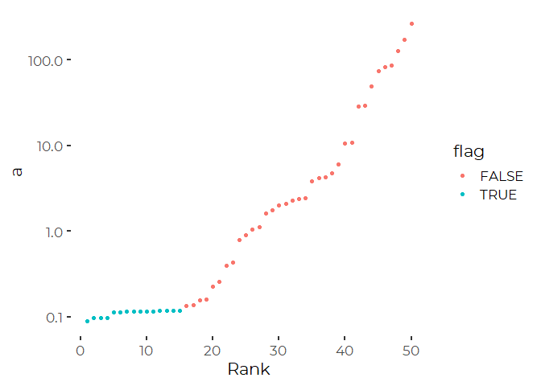
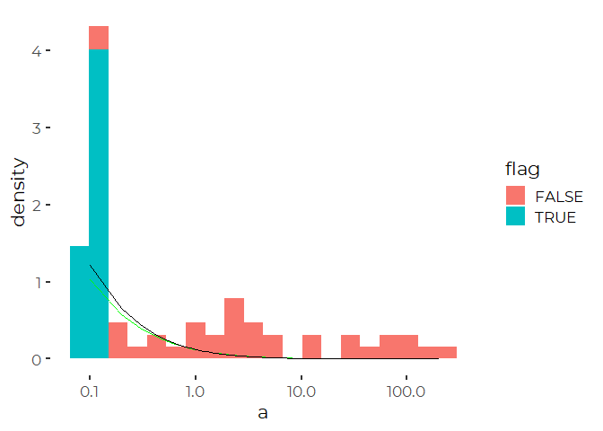

Replacing censored lognormal data with conditional means for censored
values
================
Curtis C. Bohlen, Casco Bay Estuary Partnership
7/16/2020

  - [Introduction](#introduction)
  - [Import Libraries](#import-libraries)
  - [Censored Lognormal Log Likelihood
    Function](#censored-lognormal-log-likelihood-function)
  - [What value should we substutute for censored
    data?](#what-value-should-we-substutute-for-censored-data)
  - [Cartoon Censored Lognormal Data](#cartoon-censored-lognormal-data)
  - [Testing maximum likelihood
    method](#testing-maximum-likelihood-method)
  - [Calculating Conditional Means](#calculating-conditional-means)
      - [Basic Function](#basic-function)
      - [Vectorized function](#vectorized-function)
  - [Put it all Together](#put-it-all-together)
  - [Comparison: Treating Censored Values Four
    Ways](#comparison-treating-censored-values-four-ways)
  - [The LCensMeans Package](#the-lcensmeans-package)


# Introduction

We want to calculate a reasonable sum of all PCBs observed in the
fifteen Portland harbor samples.

However, a majority of PCB observations by PCB congener and sample are
non-detects. Somehow, we need to estimate the value of censored data for
calculating totals.

It is not at all obvious how to do that. The classic approach has often
been to replace the censored data with a “worst case” value of the
relevant reporting limit, or perhaps by one half of the reporting limit.
Both of those approaches have no statistical justification, and
effectively ignore the information we get by knowing how many
observations fall below the reporting limit.

We can come up with a “better” – or at least statistically more
efficient – estimate of the mass of PCBs if we are willing to fit a
lognormal model to the censored data using maximum likelihood. We
actually have few enough “detects” for most of the PCB congeners that it
is pretty much impossible to evaluate whether a lognormal distribution
is appropriate or not. We advance anyway.

With many non-detects, this approach is considerably less pessimistic
than simply replacing each non-detect by the related reporting limit.

# Import Libraries

``` r
library(tidyverse)
```

    ## -- Attaching packages --------------------------------------------- tidyverse 1.3.0 --

    ## v ggplot2 3.3.2     v purrr   0.3.4
    ## v tibble  3.0.3     v dplyr   1.0.0
    ## v tidyr   1.1.0     v stringr 1.4.0
    ## v readr   1.3.1     v forcats 0.5.0

    ## -- Conflicts ------------------------------------------------ tidyverse_conflicts() --
    ## x dplyr::filter() masks stats::filter()
    ## x dplyr::lag()    masks stats::lag()

``` r
library(maxLik)
```

    ## Loading required package: miscTools

    ## 
    ## Please cite the 'maxLik' package as:
    ## Henningsen, Arne and Toomet, Ott (2011). maxLik: A package for maximum likelihood estimation in R. Computational Statistics 26(3), 443-458. DOI 10.1007/s00180-010-0217-1.
    ## 
    ## If you have questions, suggestions, or comments regarding the 'maxLik' package, please use a forum or 'tracker' at maxLik's R-Forge site:
    ## https://r-forge.r-project.org/projects/maxlik/

``` r
library(CBEPgraphics)
load_cbep_fonts()
```

# Censored Lognormal Log Likelihood Function

We calculate a loglikelihood for censored data directly, using a simple
function. The function call here is designed to feed the optimization
routines provided in the maxLik library. In particular, maxLik requires
the first function parameter to be a list of parameters of the
distribution to be fit (here the lognormal distribution).

``` r
 lognormalloglik <-function (params, cc, flg)
    {
    lmu    <- params[[1]]
    lsigma <- params[[2]]
    
    if (lsigma<0) return(NA)
        
    ll <- sum(if_else(flg,
                  plnorm(cc, lmu,lsigma, log.p = TRUE),  # Total density below DL
                  dlnorm(cc,lmu, lsigma, log=TRUE)) )   # Density for other obs
    return(ll)
}
```

# What value should we substutute for censored data?

Somehow we need to select a value based on that distribution that we
think is a more reasonable value than the old “one half of reporting
limit” rule.

We could consider the CONDITIONAL mean derived from the underlying
lognormal distribution, conditioned on the data being censored. While it
is probably possible to calculate that conditional mean analytically,
it’s quite simple to estimate the mean based on a random sample drawn
from the underlying distribution.

To demonstrate the idea, we will develop a cartoon censored dataset to
explore this.

(A side note – the maximum likelihood estimates with a small number of
observations may not be all that stable….)

# Cartoon Censored Lognormal Data

We create a random set of censoring levels, create a random lognormal
dataset, and simulate censoring the data.

Since we are generating the data randomly, we use “set.seed” to enable
us to repeat the analyses with the same sequence of random values.

``` r
set.seed(12345)
cens <- data.frame(cc =rnorm(5, .1, 0.025))  # Random censoring values near .1
rownames(cens) = c('a','b','c','d','e')      # Selector for those values

demo_df <- tibble( a = rlnorm(50, -1, 3),
                   b = rep(c('a','b','c','d','e'), 10)) %>% 
  mutate(c = cens[b,]) %>%
  mutate(flag = if_else(a<c,TRUE, FALSE)) %>%  # determine which are censored
  mutate(a = ifelse(a<c,c, a)) %>%            # replace value with DL
  arrange(a)
sum(demo_df$flag)                             # Count how many are censored
```

    ## [1] 15

So, 15 of 50 observations are censored given the random parameters we
chose and the particular random number sequence we used.

``` r
plt <- ggplot(demo_df, aes(1:50, a, color = flag)) +
  geom_point() + 
  theme_cbep() +
  scale_y_log10() +
  xlab('Rank')
plt
```

<!-- -->

# Testing maximum likelihood method

We can demonstrate the use of the maximum likelihood parameter
estimation on our cartoon dataset.

``` r
parms <- maxLik(lognormalloglik, start=c(-2,3), cc= demo_df$a,flg= demo_df$flag>0)
parms$estimate
```

    ## [1] -0.3825602  3.2458401

Notice that our estimates here are fairly close to the “true” value we
started with: (-1,3) . Maximum likelihood fits a lower expected value,
but higher variance. That is not unreasonable for a highly censored data
set. The graphic shows that the estimate generates a curve largely
indistinguishable from the “true” probability density except at the
lowest (largely censored) values. This bias in not entirely unexpected,
since we have lost information on the distribution of those lower values
through censoring.

``` r
plt <- ggplot(data = NULL, aes(x=a)) +
  geom_histogram(data = demo_df,
                 mapping =aes(x = a, y = ..density.., fill = flag),
                 bins=20) +
  theme_cbep() +
  scale_x_log10() +
  geom_line(data = NULL, color = 'green',
            aes(x= seq(0.1,  200, 0.1),
                y = dlnorm(seq(0.1,  200, 0.1),
                           parms$estimate[[1]],
                           parms$estimate[[2]]))) +
    geom_line(data = NULL,
            aes(x= seq(0.1,  200, 0.1),
                y = dlnorm(seq(0.1,  200, 0.1),
                           -1, 3)))
plt
```

<!-- -->

# Calculating Conditional Means

Now, we need to calculate conditional means. We do this via numerical
simulation.

We draw 1000 samples from a truncated lognormal distribution, and
calculate the mean of those draws. That provides a fairly accurate
estimate of the mean of the truncated distribution. With 1000 samples,
the error is probably dominated by uncertainty in the maximum likelihood
estimation rather than uncertainty due to an insufficient sample.
Nevertheless, a larger random sample maybe needed for high precision
work.

## Basic Function

Here’s a function to do just that for a single distribution and cutoff
value. Note this is also a random process, so results will vary slightly
if you run this code several times. Higher sample sizes should reduce
the variability, but variability is probably dominated by parameter
uncertainty….

``` r
MeanTruncatedLogNormal <- function(lmu, lsigma, cutoff,  sz = 1000)
  {
  # Figure out haw many values to draw
  estsample <- sz + sz / plnorm(cutoff, lmu, lsigma) 
  # We calculate a lot of extras
  rawsample <- rlnorm(estsample, lmu, lsigma)  
  # Throw out all the samples that are too large
  sample <- rawsample[rawsample<cutoff]
  # Take the first sz of them (if there are enough....)
  sample<- sample[1:sz]  
  # And finally, calculate the mean
  return(mean(sample))                                  
  }

# Lets take a look at that for a particular observation 
MeanTruncatedLogNormal(parms$estimate[1],parms$estimate[2], demo_df[3,]$c)
```

    ## [1] 0.03038203

## Vectorized function

We use the Vectorize() function from base R to convert that into a
function that can accept a vector rather than just an individual value.
Note this function does not pay any attention to which observations are
censored. That reflects the sequential problem solving approach I took
to figuring this out, and makes the logic slightly more transparent.

``` r
MeanTruncLN <- Vectorize(MeanTruncatedLogNormal, "cutoff")
MeanTruncLN(parms$estimate[1],parms$estimate[2], demo_df$c)
```

    ##  [1] 0.02636658 0.02950533 0.02821146 0.02845010 0.03246453 0.03397353
    ##  [7] 0.03392199 0.03281441 0.03351675 0.03291972 0.03258251 0.03267524
    ## [13] 0.03351671 0.03483524 0.03592299 0.02861420 0.03274614 0.02805193
    ## [19] 0.02849059 0.03467768 0.03232799 0.03356052 0.02977146 0.03339920
    ## [25] 0.03445992 0.02768141 0.02950946 0.03256890 0.02681745 0.02995196
    ## [31] 0.02682266 0.02724942 0.02875649 0.03461647 0.03383572 0.03439512
    ## [37] 0.03295890 0.03253891 0.02609421 0.02623545 0.03394132 0.03447800
    ## [43] 0.03436594 0.02684665 0.02631386 0.03283237 0.03345913 0.03344272
    ## [49] 0.02909448 0.03346641

# Put it all Together

So now we can generate “implied” expected mean values for an entire
vector of censoring thresholds, given parameters of a (single) lognormal
distribution. Notice that this function can accept different detection
limits, but it assumes all observations are drawn from a single
lognormal distribution.

We still need to combine everything, to generate a simulated data set of
censored and uncensored data from which we can calculate an appropriate
estimated total PCB load.

We need a function that when fed censored data and the flags indicating
which observations were censored, will return a modified vector of
combined observations and estimates of the conditional means of censored
data based on a lognormal distribution.

``` r
SemiSimulatedLN <-function (cc, flg) {
  r <- maxLik( lognormalloglik, start=c(-2,3), cc=cc,flg=flg)  #Calculate maximum likelihood parameter estimates
  es <- r$estimate
  lmu = es[1]
  lsigma <- es[2]
  res <- ifelse(flg, MeanTruncLN(lmu, lsigma, cc), cc)                  #Calculate a replacement vector
  return(res)
}
(q <- SemiSimulatedLN (demo_df$a, demo_df$flag))
```

    ##  [1]   0.02723533   0.02935233   0.02949874   0.02957160   0.03266398
    ##  [6]   0.03421267   0.03505619   0.03346005   0.03297775   0.03437190
    ## [11]   0.03292359   0.03530727   0.03389772   0.03600322   0.03386162
    ## [16]   0.13605001   0.13914208   0.15684782   0.16064596   0.22606495
    ## [21]   0.25956622   0.39748549   0.43204342   0.78884422   0.90137951
    ## [26]   1.05652849   1.11838267   1.60570809   1.75180971   2.01820754
    ## [31]   2.11607501   2.30797491   2.36585482   2.43584971   3.81471430
    ## [36]   4.20224764   4.26609769   4.77481467   6.11914035  10.61361865
    ## [41]  10.86484666  29.00172316  29.43511088  49.27106138  73.93612558
    ## [46]  82.70603355  85.79288959 126.85922336 172.01316459 267.86969218

``` r
tmp <- demo_df %>% mutate(final = q )
ggplot(tmp, aes(a,final, color = flag)) +
  geom_abline(intercept=0, slope = 1, color = 'blue') + 
  geom_point(alpha = 0.25, size = 3) + 
  geom_hline(data = cens, mapping=aes(yintercept = cc)) +
  scale_x_log10() + 
  scale_y_log10() +
  xlab('Original Simulated Value') +
  ylab('Replacement Value')
```

<!-- -->

# Comparison: Treating Censored Values Four Ways

``` r
knitr::kable(tibble(Correction = c('Reporting Limit',
                                   'Half Reporting Limit',
                                   'Lognormal Estimates',
                                   'Replace with Zero'),
                    Value = c(mean(demo_df$a),
                              mean(ifelse(demo_df$flag,
                                          demo_df$a/2,
                                          demo_df$a)),
                              mean(q),
                              mean(ifelse(demo_df$flag,
                                          0,
                                          demo_df$a)))), digits = 2)
```

| Correction           | Value |
| :------------------- | ----: |
| Reporting Limit      | 19.67 |
| Half Reporting Limit | 19.65 |
| Lognormal Estimates  | 19.65 |
| Replace with Zero    | 19.64 |

So results look appropriate, and had only a minor effect on results
here.

# The LCensMeans Package

The logic of the methods described here have been built into the
[LCensMeans package](https://github.com/ccb60/LCensMeans). That package
initially followed the logic described here exactly. It is, however, in
active development, and several optimization and generalizations are
possible. The conceptual underpinnings however, remain the same.
