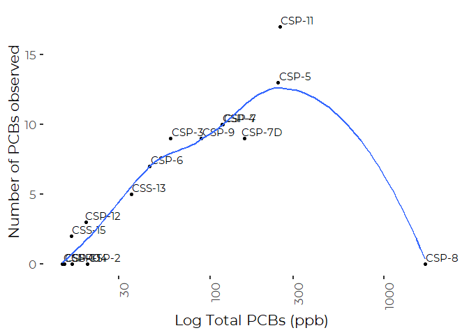
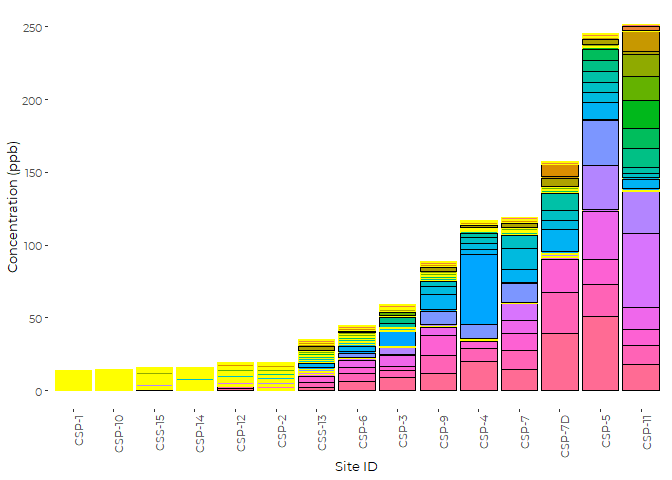
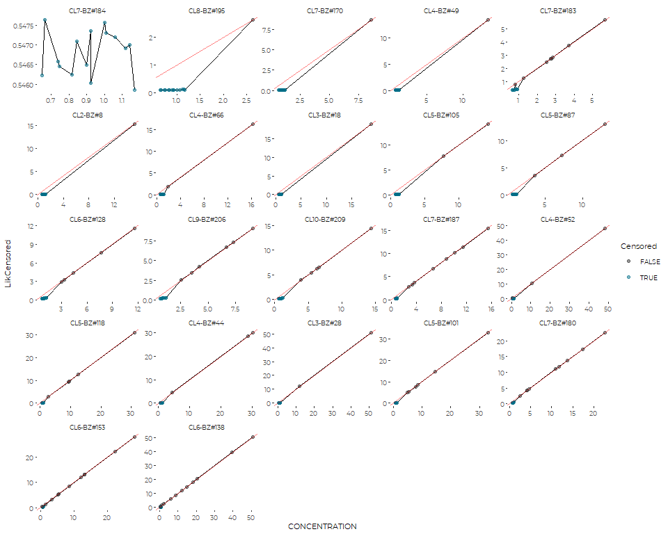
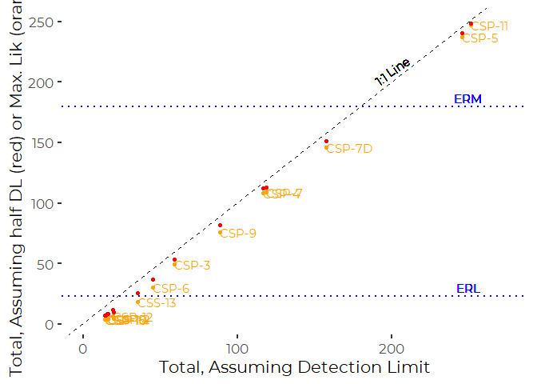

Exploratory analysis of Sediment Toxicity Data : PCBs
================
Curtis C. Bohlen, Casco Bay Estuary Partnership
7/16/2020

  - [Install Libraries](#install-libraries)
  - [Load Contaminants Data](#load-contaminants-data)
      - [PCB Terminology](#pcb-terminology)
      - [Chemical Parameters.](#chemical-parameters.)
      - [Extract PCBs Data Only](#extract-pcbs-data-only)
      - [Question about Reporting
        Limits](#question-about-reporting-limits)
      - [Create PCB Data](#create-pcb-data)
      - [A Problem](#a-problem)
      - [Final Data Set](#final-data-set)
  - [Exploratory Graphics](#exploratory-graphics)
      - [PCBs by Site](#pcbs-by-site)
      - [Sites by PCBs](#sites-by-pcbs)
  - [Correlations](#correlations)
  - [Analysis of Non Detects](#analysis-of-non-detects)
      - [Distributional graphics](#distributional-graphics)
  - [Alternate Estimates of Sum of
    PCBs](#alternate-estimates-of-sum-of-pcbs)
      - [Alternate Estimates of Sum of
        PAHs](#alternate-estimates-of-sum-of-pahs)
      - [Applying to the PCBs Data](#applying-to-the-pcbs-data)
      - [Implications of Alternate Treatment of
        NDs](#implications-of-alternate-treatment-of-nds)
  - [Check Consistency](#check-consistency)
  - [Conclusion](#conclusion)


# Install Libraries

``` r
library(readxl)
library(tidyverse)
```

    ## -- Attaching packages --------------------------------------------- tidyverse 1.3.0 --

    ## v ggplot2 3.3.2     v purrr   0.3.4
    ## v tibble  3.0.3     v dplyr   1.0.0
    ## v tidyr   1.1.0     v stringr 1.4.0
    ## v readr   1.3.1     v forcats 0.5.0

    ## -- Conflicts ------------------------------------------------ tidyverse_conflicts() --
    ## x dplyr::filter() masks stats::filter()
    ## x dplyr::lag()    masks stats::lag()

``` r
library(GGally)
```

    ## Registered S3 method overwritten by 'GGally':
    ##   method from   
    ##   +.gg   ggplot2

``` r
library(maxLik)
```

    ## Loading required package: miscTools

    ## 
    ## Please cite the 'maxLik' package as:
    ## Henningsen, Arne and Toomet, Ott (2011). maxLik: A package for maximum likelihood estimation in R. Computational Statistics 26(3), 443-458. DOI 10.1007/s00180-010-0217-1.
    ## 
    ## If you have questions, suggestions, or comments regarding the 'maxLik' package, please use a forum or 'tracker' at maxLik's R-Forge site:
    ## https://r-forge.r-project.org/projects/maxlik/

``` r
library(CBEPgraphics)
load_cbep_fonts()

library(LCensMeans)
```

# Load Contaminants Data

``` r
sibfldnm <- 'Derived_Data'
parent <- dirname(getwd())
sibling <- paste(parent,sibfldnm, sep = '/')
fn <- 'working_data.xls'

the_data <- read_excel(paste(sibling,fn, sep='/'), 
    sheet = "Combined", col_types = c("skip", 
        "text", "skip", "skip", "skip", 
        "skip", "skip", "skip", "skip", 
        "text", "text", "numeric", "text", 
        "numeric", "text", "numeric", "numeric", 
        "text", "text", "text", "skip", 
        "skip", "skip", "skip", "skip", 
        "numeric", "numeric", "skip", "skip", 
        "skip", "skip", "skip", "skip", 
        "skip")) %>%
  mutate(SAMPLE_ID = factor(SAMPLE_ID, levels = c("CSP-1", "CSP-2", "CSP-3", "CSP-4", "CSP-5", "CSP-6",
                                                  "CSP-7", "CSP-7D", "CSP-8", "CSP-9", "CSP-10", "CSP-11",
                                                  "CSP-12", "CSS-13", "CSP-14", "CSS-15")))
```

## PCB Terminology

Unfortunately, the PCB terminology is complex and non-intuitive, with
the same compounds referred to in multiple ways. We can cross-correlate
by CAS numbers as follows:

``` r
fn <- 'PCB_nomenclature.xlsx'

pcbnames <- read_excel(file.path(sibling, fn)) %>%
  mutate(CAS_NO = gsub('-', '', CASRN))

the_data %>%
  group_by(PARAMETER_NAME) %>%
  summarize(CAS_NO = first(CAS_NO), .groups = 'drop') %>%
  filter(grepl(pattern='CL', x=PARAMETER_NAME)) %>%
  mutate(name = pcbnames$`IUPAC Name`[match(CAS_NO, pcbnames$CAS_NO)]) %>%
  mutate(congener = pcbnames$`Congener Number`[match(CAS_NO, pcbnames$CAS_NO)]) %>%
  arrange(congener) %>%
  knitr::kable(col.names = c('PCB Name', 'CAS No.',
                             'Chemical', 'Congener No.') ,align = 'l')
```

| PCB Name     | CAS No.  | Chemical                                 | Congener No. |
| :----------- | :------- | :--------------------------------------- | :----------- |
| CL2-BZ\#8    | 34883437 | 2,4’-Dichlorobiphenyl                    | 8            |
| CL3-BZ\#18   | 37680652 | 2,2’,5-Trichlorobiphenyl                 | 18           |
| CL3-BZ\#28   | 7012375  | 2,4,4’-Trichlorobiphenyl                 | 28           |
| CL4-BZ\#44   | 41464395 | 2,2’,3,5’-Tetrachlorobiphenyl            | 44           |
| CL4-BZ\#49   | 41464408 | 2,2’,4,5’-Tetrachlorobiphenyl            | 49           |
| CL4-BZ\#52   | 35693993 | 2,2’,5,5’-Tetrachlorobiphenyl            | 52           |
| CL4-BZ\#66   | 32598100 | 2,3’,4,4’-Tetrachlorobiphenyl            | 66           |
| CL5-BZ\#87   | 38380028 | 2,2’,3,4,5’-Pentachlorobiphenyl          | 87           |
| CL5-BZ\#101  | 37680732 | 2,2’,4,5,5’-Pentachlorobiphenyl          | 101          |
| CL5-BZ\#105  | 32598144 | 2,3,3’,4,4’-Pentachlorobiphenyl          | 105          |
| CL5-BZ\#118  | 31508006 | 2,3’,4,4’,5-Pentachlorobiphenyl          | 118          |
| CL6-BZ\#128  | 38380073 | 2,2’,3,3’,4,4’-Hexachlorobiphenyl        | 128          |
| CL6-BZ\#138  | 35065282 | 2,2’,3,4,4’,5’-Hexachlorobiphenyl        | 138          |
| CL6-BZ\#153  | 35065271 | 2,2’,4,4’,5,5’-Hexachlorobiphenyl        | 153          |
| CL7-BZ\#170  | 35065306 | 2,2’,3,3’,4,4’,5-Heptachlorobiphenyl     | 170          |
| CL7-BZ\#180  | 35065293 | 2,2’,3,4,4’,5,5’-Heptachlorobiphenyl     | 180          |
| CL7-BZ\#183  | 52663691 | 2,2’,3,4,4’,5’,6-Heptachlorobiphenyl     | 183          |
| CL7-BZ\#184  | 74472483 | 2,2’,3,4,4’,6,6’-Heptachlorobiphenyl     | 184          |
| CL7-BZ\#187  | 52663680 | 2,2’,3,4’,5,5’,6-Heptachlorobiphenyl     | 187          |
| CL8-BZ\#195  | 52663782 | 2,2’,3,3’,4,4’,5,6-Octachlorobiphenyl    | 195          |
| CL9-BZ\#206  | 40186729 | 2,2’,3,3’,4,4’,5,5’,6-Nonachlorobiphenyl | 206          |
| CL10-BZ\#209 | 2051243  | Decachlorobiphenyl                       | 209          |

``` r
rm(pcbnames)
```

The PCB names provided in the data incorporate both the number of
chlorines and the PCB congener number, The official IUPAC names are
available, but would be impenetrable to most State of the Bay readers.
This table does provide more terms under which to look for screening
levels under the squirt tables. But the SQUIRTS do not contain screening
levels for specific PCBs in marine sediments, only for the SUM of PCBs.

## Chemical Parameters.

Here’s the list of PCBs extracted and analyzed by Stantec/Campbell

``` r
sibfldnm <- 'Derived_Data'
parent <- dirname(getwd())
sibling <- paste(parent,sibfldnm, sep = '/')
fn <- 'working_data.xls'

PCBs_names <- read_excel(paste(sibling,fn, sep='/'), sheet = "PCBs", skip = 3) %>%
  select(1) %>%
  slice(1:22) #%>%
```

    ## New names:
    ## * Result -> Result...3
    ## * Qual -> Qual...4
    ## * Result -> Result...5
    ## * Qual -> Qual...6
    ## * Result -> Result...7
    ## * ...

``` r
PCBs_names <- PCBs_names$PARAMETER_NAME
cat(do.call(paste, c(as.list(PCBs_names),sep = ', ')))
```

    ## CL2-BZ#8, CL3-BZ#18, CL3-BZ#28, CL4-BZ#44, CL4-BZ#49, CL4-BZ#52, CL4-BZ#66, CL5-BZ#87, CL5-BZ#101, CL5-BZ#105, CL5-BZ#118, CL6-BZ#128, CL6-BZ#138, CL6-BZ#153, CL7-BZ#170, CL7-BZ#180, CL7-BZ#183, CL7-BZ#184, CL7-BZ#187, CL8-BZ#195, CL9-BZ#206, CL10-BZ#209

## Extract PCBs Data Only

We filter down to selected parameters defined by that list of chemicals.
The second and third filters remove some QA/QC samples.

We have some duplicate samples: 1. For CSP-6 and CSP-15 - all
measurements 2. CSP-10 - TOC data only - and 3. CSP-9 - all observations
EXCEPT TOC

For this analysis we calculate average values across the duplicate
samples.

Notice that data are far from normal, even after transformation. And
non-detects frequently outnumber the detects. For detailed statistical
analysis it may be valuable to evaluate total detections and total
estimated PCB loads.

## Question about Reporting Limits

The pattern of the reporting limits appears odd. It looks like the same
detection limits were assigned to all compounds within each sample.
Usually, the detection limits vary by compound. Note also that some PCBs
were never detected.

## Create PCB Data

We load the data in a format that records both observed values and
reporting limits in a single data column, along with a second (logical)
column that indicates whether the value was observed or represents a
detection limit.

``` r
PCBs_data_long <- the_data %>% 
  filter (the_data$PARAMETER_NAME %in% PCBs_names) %>%
  filter(is.na(`%_RECOVERY`)) %>%
  filter(SAMPLE_ID != 'QC') %>%
  mutate(CONCENTRATION = ifelse(is.na(CONCENTRATION) & LAB_QUALIFIER == 'U',
                                REPORTING_LIMIT, CONCENTRATION)) %>%
  group_by(SAMPLE_ID, PARAMETER_NAME) %>%
  summarize(CONCENTRATION = mean(CONCENTRATION, na.rm=TRUE),
            samples = n(),
            censored = sum(LAB_QUALIFIER=='U', na.rm=TRUE),
            .groups = 'drop') %>%
  ungroup() %>%
  rename(PCB = PARAMETER_NAME) %>%
  mutate(PCB = factor(PCB)) %>%
  mutate(PCB = reorder(PCB, CONCENTRATION, function(x) mean(x, na.rm=TRUE)))

sum(PCBs_data_long$censored> 0 & PCBs_data_long$censored<PCBs_data_long$samples)
```

    ## [1] 0

That zero shows that replicate samples are either all detects or all
non-detects.

## A Problem

``` r
tmp <- PCBs_data_long %>%
  group_by(SAMPLE_ID) %>%
  summarize(totPCBs = sum(CONCENTRATION, na.rm = TRUE),
            countPCBs = sum(censored==0, na.rm=TRUE),
            .groups = 'drop')

plt <- ggplot(tmp, aes(totPCBs, countPCBs)) +
  geom_point() +
  geom_text(aes(label = SAMPLE_ID),nudge_y = .5, nudge_x = .1) +
  geom_smooth(se=FALSE) +
  scale_x_log10() +
  xlab('Log Total PCBs (ppb)') +
  ylab('Number of PCBs observed') +
  theme_cbep() +
  theme(axis.text.x = element_text(angle = 90, hjust = 1)) +
  theme(panel.grid = element_blank()) 
plt
```

    ## `geom_smooth()` using method = 'loess' and formula 'y ~ x'

<!-- -->

``` r
rm(tmp)
```

The data for CSP-8 includes high values for ALL PCBs, however, those
high values are all flagged as non-detects.

Looking at the raw data, it is clear the reporting limits are sky high
for this one site (almost two order of magnitude higher than for other
sites), so this provides us with no useful information about
contaminants in the field. It is worth noting that the limits for most
other organic contaminants are similarly high. This suggests we should
drop this site from analyses of organic contaminants, at least if we
rely on analysis of sky-high non-detects.

We drop the site from further analysis.

``` r
PCBs_data_long <- PCBs_data_long %>%
  filter(SAMPLE_ID != 'CSP-8')
```

## Final Data Set

``` r
lvls <- PCBs_data_long %>%
  group_by(SAMPLE_ID) %>%
  summarize(totPCBs = sum(CONCENTRATION, na.rm = TRUE),
            .groups = 'drop') %>%
  mutate(SAMPLE_ID = factor(SAMPLE_ID, levels = SAMPLE_ID[order(totPCBs)])) %>%
  pull(SAMPLE_ID) %>%
  levels()

PCBs_data_long <- PCBs_data_long %>%
  mutate(SAMPLE_ID = factor(SAMPLE_ID, levels = lvls))

rm(lvls)
```

# Exploratory Graphics

## PCBs by Site

``` r
plt <- ggplot(PCBs_data_long, aes(SAMPLE_ID, CONCENTRATION)) +
  geom_col(aes(fill = PCB, color = censored>0)) +
  scale_color_manual(values = c('black', 'yellow')) +
  xlab('Site ID') +
  ylab('Concentration (ppb)') +
  theme_cbep(base_size = 10) +
  theme(axis.text.x = element_text(angle = 90, hjust = 1)) +
  theme(legend.position = "none")
plt
```

<!-- -->

## Sites by PCBs

``` rsites_by_pcbs
plt <- ggplot(PCBs_data_long, aes(PCB, CONCENTRATION)) +
  geom_col(aes(fill = SAMPLE_ID, color = censored>0), lwd = 1) +
  scale_color_manual(values = c('black', 'yellow'), name = 'Censored') +
  xlab('PCB') +
  ylab('Concentration (ppb)') +
  theme_cbep(base_size = 10) +
  theme(axis.text.x = element_text(angle = 90, hjust = 1)) +
  theme(panel.grid = element_blank()) +
  theme(legend.key.size = unit(.15, 'in'))
plt
```

So, the mix of PCBs varies plot to plot quite a bit. Most non-detects
happened at a handful of sites, where they tended to happen for multiple
PCBs.

# Correlations

We can look at correlations, but they are not all that informative,
because of the large number of non-detects. It is better here to conduct
analyses using methods that address the non–detects explicitly. But to a
first approximation, note that the correlation coefficients are high
between almost all PCBs. Some of that, unfortunately, reflects the
identical detection limits for all compounds reported by the laboratory.

``` r
PCBs_data_long %>%
  pivot_wider(id_cols = SAMPLE_ID,
              names_from = 'PCB',
              values_from = 'CONCENTRATION') %>%
  select(-SAMPLE_ID) %>%
  cor(method = 'spearman') %>%
  knitr::kable(digits = 2)
```

|              | CL10-BZ\#209 | CL2-BZ\#8 | CL3-BZ\#18 | CL3-BZ\#28 | CL4-BZ\#44 | CL4-BZ\#49 | CL4-BZ\#52 | CL4-BZ\#66 | CL5-BZ\#101 | CL5-BZ\#105 | CL5-BZ\#118 | CL5-BZ\#87 | CL6-BZ\#128 | CL6-BZ\#138 | CL6-BZ\#153 | CL7-BZ\#170 | CL7-BZ\#180 | CL7-BZ\#183 | CL7-BZ\#184 | CL7-BZ\#187 | CL8-BZ\#195 | CL9-BZ\#206 |
| :----------- | -----------: | --------: | ---------: | ---------: | ---------: | ---------: | ---------: | ---------: | ----------: | ----------: | ----------: | ---------: | ----------: | ----------: | ----------: | ----------: | ----------: | ----------: | ----------: | ----------: | ----------: | ----------: |
| CL10-BZ\#209 |         1.00 |      0.69 |       0.69 |       0.75 |       0.66 |       0.69 |       0.64 |       0.58 |        0.76 |        0.73 |        0.95 |       0.64 |        0.77 |        0.87 |        0.89 |        0.78 |        0.95 |        0.91 |        0.75 |        0.94 |        0.69 |        0.99 |
| CL2-BZ\#8    |         0.69 |      1.00 |       1.00 |       0.95 |       0.90 |       1.00 |       0.60 |       0.92 |        0.84 |        0.98 |        0.68 |       0.91 |        0.73 |        0.64 |        0.72 |        0.91 |        0.75 |        0.74 |        0.95 |        0.78 |        1.00 |        0.67 |
| CL3-BZ\#18   |         0.69 |      1.00 |       1.00 |       0.95 |       0.90 |       1.00 |       0.60 |       0.92 |        0.84 |        0.98 |        0.68 |       0.91 |        0.73 |        0.64 |        0.72 |        0.91 |        0.75 |        0.74 |        0.95 |        0.78 |        1.00 |        0.67 |
| CL3-BZ\#28   |         0.75 |      0.95 |       0.95 |       1.00 |       0.84 |       0.95 |       0.53 |       0.87 |        0.89 |        0.92 |        0.73 |       0.86 |        0.66 |        0.64 |        0.74 |        0.84 |        0.75 |        0.72 |        0.87 |        0.78 |        0.95 |        0.75 |
| CL4-BZ\#44   |         0.66 |      0.90 |       0.90 |       0.84 |       1.00 |       0.90 |       0.65 |       0.95 |        0.93 |        0.94 |        0.67 |       1.00 |        0.81 |        0.70 |        0.73 |        0.81 |        0.72 |        0.74 |        0.85 |        0.75 |        0.90 |        0.66 |
| CL4-BZ\#49   |         0.69 |      1.00 |       1.00 |       0.95 |       0.90 |       1.00 |       0.60 |       0.92 |        0.84 |        0.98 |        0.68 |       0.91 |        0.73 |        0.64 |        0.72 |        0.91 |        0.75 |        0.74 |        0.95 |        0.78 |        1.00 |        0.67 |
| CL4-BZ\#52   |         0.64 |      0.60 |       0.60 |       0.53 |       0.65 |       0.60 |       1.00 |       0.68 |        0.55 |        0.58 |        0.72 |       0.64 |        0.75 |        0.63 |        0.55 |        0.62 |        0.61 |        0.59 |        0.65 |        0.60 |        0.60 |        0.62 |
| CL4-BZ\#66   |         0.58 |      0.92 |       0.92 |       0.87 |       0.95 |       0.92 |       0.68 |       1.00 |        0.86 |        0.90 |        0.58 |       0.96 |        0.74 |        0.60 |        0.65 |        0.82 |        0.65 |        0.66 |        0.85 |        0.67 |        0.92 |        0.57 |
| CL5-BZ\#101  |         0.76 |      0.84 |       0.84 |       0.89 |       0.93 |       0.84 |       0.55 |       0.86 |        1.00 |        0.90 |        0.76 |       0.93 |        0.73 |        0.75 |        0.80 |        0.74 |        0.79 |        0.75 |        0.78 |        0.81 |        0.84 |        0.77 |
| CL5-BZ\#105  |         0.73 |      0.98 |       0.98 |       0.92 |       0.94 |       0.98 |       0.58 |       0.90 |        0.90 |        1.00 |        0.72 |       0.95 |        0.79 |        0.71 |        0.78 |        0.89 |        0.79 |        0.78 |        0.92 |        0.82 |        0.98 |        0.72 |
| CL5-BZ\#118  |         0.95 |      0.68 |       0.68 |       0.73 |       0.67 |       0.68 |       0.72 |       0.58 |        0.76 |        0.72 |        1.00 |       0.65 |        0.74 |        0.84 |        0.81 |        0.70 |        0.88 |        0.80 |        0.74 |        0.87 |        0.68 |        0.94 |
| CL5-BZ\#87   |         0.64 |      0.91 |       0.91 |       0.86 |       1.00 |       0.91 |       0.64 |       0.96 |        0.93 |        0.95 |        0.65 |       1.00 |        0.81 |        0.69 |        0.73 |        0.81 |        0.71 |        0.72 |        0.85 |        0.74 |        0.91 |        0.65 |
| CL6-BZ\#128  |         0.77 |      0.73 |       0.73 |       0.66 |       0.81 |       0.73 |       0.75 |       0.74 |        0.73 |        0.79 |        0.74 |       0.81 |        1.00 |        0.91 |        0.87 |        0.77 |        0.86 |        0.84 |        0.70 |        0.85 |        0.73 |        0.81 |
| CL6-BZ\#138  |         0.87 |      0.64 |       0.64 |       0.64 |       0.70 |       0.64 |       0.63 |       0.60 |        0.75 |        0.71 |        0.84 |       0.69 |        0.91 |        1.00 |        0.97 |        0.67 |        0.92 |        0.85 |        0.61 |        0.91 |        0.64 |        0.92 |
| CL6-BZ\#153  |         0.89 |      0.72 |       0.72 |       0.74 |       0.73 |       0.72 |       0.55 |       0.65 |        0.80 |        0.78 |        0.81 |       0.73 |        0.87 |        0.97 |        1.00 |        0.76 |        0.96 |        0.87 |        0.69 |        0.95 |        0.72 |        0.92 |
| CL7-BZ\#170  |         0.78 |      0.91 |       0.91 |       0.84 |       0.81 |       0.91 |       0.62 |       0.82 |        0.74 |        0.89 |        0.70 |       0.81 |        0.77 |        0.67 |        0.76 |        1.00 |        0.82 |        0.82 |        0.96 |        0.85 |        0.91 |        0.73 |
| CL7-BZ\#180  |         0.95 |      0.75 |       0.75 |       0.75 |       0.72 |       0.75 |       0.61 |       0.65 |        0.79 |        0.79 |        0.88 |       0.71 |        0.86 |        0.92 |        0.96 |        0.82 |        1.00 |        0.93 |        0.76 |        1.00 |        0.75 |        0.96 |
| CL7-BZ\#183  |         0.91 |      0.74 |       0.74 |       0.72 |       0.74 |       0.74 |       0.59 |       0.66 |        0.75 |        0.78 |        0.80 |       0.72 |        0.84 |        0.85 |        0.87 |        0.82 |        0.93 |        1.00 |        0.77 |        0.92 |        0.74 |        0.90 |
| CL7-BZ\#184  |         0.75 |      0.95 |       0.95 |       0.87 |       0.85 |       0.95 |       0.65 |       0.85 |        0.78 |        0.92 |        0.74 |       0.85 |        0.70 |        0.61 |        0.69 |        0.96 |        0.76 |        0.77 |        1.00 |        0.80 |        0.95 |        0.69 |
| CL7-BZ\#187  |         0.94 |      0.78 |       0.78 |       0.78 |       0.75 |       0.78 |       0.60 |       0.67 |        0.81 |        0.82 |        0.87 |       0.74 |        0.85 |        0.91 |        0.95 |        0.85 |        1.00 |        0.92 |        0.80 |        1.00 |        0.78 |        0.94 |
| CL8-BZ\#195  |         0.69 |      1.00 |       1.00 |       0.95 |       0.90 |       1.00 |       0.60 |       0.92 |        0.84 |        0.98 |        0.68 |       0.91 |        0.73 |        0.64 |        0.72 |        0.91 |        0.75 |        0.74 |        0.95 |        0.78 |        1.00 |        0.67 |
| CL9-BZ\#206  |         0.99 |      0.67 |       0.67 |       0.75 |       0.66 |       0.67 |       0.62 |       0.57 |        0.77 |        0.72 |        0.94 |       0.65 |        0.81 |        0.92 |        0.92 |        0.73 |        0.96 |        0.90 |        0.69 |        0.94 |        0.67 |        1.00 |

# Analysis of Non Detects

Here we continue the analysis with an explicit effort to model the
non-detects. We do this, as elsewhere, using a simple maximum likelihood
estimation procedure to calculate an estimated distribution for each
contaminant, and then replace the NDs with an estimate of the
conditional mean suggested by those concentrations.

## Distributional graphics

What kind of distribution do we actually have?

``` r
plt <- ggplot(PCBs_data_long, aes(PCB, CONCENTRATION)) +
  geom_violin() +
  geom_point(aes(color = censored>0), alpha = 0.2, size=2) +
  scale_y_log10() +
  theme(axis.text.x = element_text(angle=90))
  
plt
```

<!-- -->
So, the bulk of our data lies in censored values, which themselves
varied from site to site. higher, There is far too little data here to
determine a distribution for these data, but a lognormal or Gamma
distribution are both likely, give the constraint that values can not be
lower than zero. Here we use a lognormal distribution, largely for its
simplicity.

# Alternate Estimates of Sum of PCBs

## Alternate Estimates of Sum of PAHs

We want to focus on analysis of the sum of PCBs, because all PCBs are
highly correlated, and the SQUIRT tables provide screening criteria for
the sum of PCBs.  
The question is, how do we best handle the non-detects. Often in
environmental analyses, non-detects are replaced by zero, by the
detection limit, or by half the detection limit, but none of those
conventions rests on strong statistical principals. We instead implement
a method that estimates the (unobserved) value of non-detects using a
conditional mean of censored observations derived from a maximum
likelihood procedure.

The idea is to fit a maximum likelihood model to the data assuming a
censored lognormal distribution. With a lognormal density in hand, we
can estimate a conditional mean of for “unobserved” observations below a
the detection limit by sampling from the underlying lognormal
distribution 1000 times (or more) and calculating a mean.

We developed functions for implementing this procedure. Those functions
have been incorporated into a small package, ‘LCensMeans’ to facilitate
use in CBEP State of the Bay Analyses.

See the help files in the LCensMeans package for more explanation, or
read the R Notebook “Conditional Means of Censored Distributions”, where
we developed the basic approach.

The LCensMeans package is in active development in pre-release form, so
there is no guarantee that the user interface will not change. The
following code worked as of July 2020.

## Applying to the PCBs Data

Note the use of “mutate” after the group\_by() so that the dataframe is
not collapsed to the grouping variables, as it would be by summary().

The calculations involved are random, so if you want to get exactly the
same results, you need to set the random number seed with set.seed()

``` r
dat2 <- PCBs_data_long %>%
  group_by(PCB) %>%
  mutate(LikCensored = sub_conditional_means(CONCENTRATION, censored>0)) %>%
  mutate(HalfDL = ifelse(censored>0, CONCENTRATION/2, CONCENTRATION)) %>%
  ungroup()

res2 <- dat2 %>%
  group_by(SAMPLE_ID) %>%
  summarize(LNtotPCB = sum(LikCensored),
            halfDLtotPCB = sum(HalfDL),
            totPCB = sum(CONCENTRATION), 
            .groups='drop')
```

## Implications of Alternate Treatment of NDs

``` r
ggplot(dat2, aes(CONCENTRATION,LikCensored)) +
  geom_line() +
  geom_point(aes(color = censored>0), alpha = 0.5) + 
  geom_abline(intercept = 0, slope= 1, alpha = 0.5, color = 'red') + 
  facet_wrap('PCB', scales = 'free') +
  theme_cbep(base_size = 8) +
  scale_color_manual(values = cbep_colors2(), name = 'Censored')
```

<!-- --> The
first panel shows the essentially meaningless variation for a parameter
with no detections, but variable detection limits. Note that the
“corrected” estimates are all small and only vary in the fourth
decimal place, well below differences that can possibly matter. In
general, that is the pattern we observe - -chemicals with large numbers
of non-detects tend to be present in low concentrations, even in sites
where they were detected. This the non-detects have relatively little
effect on estimates of total PCBs.

# Check Consistency

I want to make sure the code was applying the fit correctly PCB by PCB,
so let’s calculate directly for one PCB, and compare results.

``` r
PCBs_data_long %>%
  filter(PCB=='CL9-BZ#206') %>%
  mutate(LikCensored = sub_conditional_means(CONCENTRATION, censored>0)) %>%
  select(LikCensored) %>%
  mutate(test = dat2[dat2$PCB=='CL9-BZ#206',]$LikCensored) %>%
  knitr::kable(digits = 3)
```

| LikCensored |  test |
| ----------: | ----: |
|       0.220 | 0.209 |
|       0.278 | 0.285 |
|       0.286 | 0.273 |
|       4.220 | 4.220 |
|       7.300 | 7.300 |
|       0.337 | 0.323 |
|       9.080 | 9.080 |
|       6.690 | 6.690 |
|       3.500 | 3.500 |
|       0.220 | 0.221 |
|       2.550 | 2.550 |
|       0.268 | 0.265 |
|       0.365 | 0.328 |
|       0.237 | 0.242 |
|       0.238 | 0.245 |

So, results are not quite identical, but close enough (usually under 1%)
so that the differences are almost surely due to the random sampling
strategy used. \# Impact of Selection of ND Method on Conclusions

``` r
ggplot(res2, aes(x=totPCB))+
  geom_point(aes(y=LNtotPCB), color = 'orange') +
  geom_text(aes(y=LNtotPCB, label = SAMPLE_ID), color = 'orange', hjust = 0) +
  geom_point(aes(y=halfDLtotPCB), color = 'red') +
  geom_abline(intercept = 0, slope = 1, lty = 2) +
  geom_text(aes(x=200, y=210, label = '1:1 Line'), angle = 35) +
  geom_hline(yintercept = 22.7, color = 'blue', lty=3, size=1) +    #ERL
  geom_text(aes(x=250, y=30, label = 'ERL'), color = 'blue') +
  geom_hline(yintercept = 180, color = 'blue', lty=3, size=1) +     #ERM
  geom_text(aes(x=250, y=187, label = 'ERM'), color = 'blue') +
  xlab('Total, Assuming Detection Limit') +
  ylab('Total, Assuming half DL (red) or Max. Lik (orange)') +
  xlim(c(0,275)) +
  theme_cbep()
```

<!-- -->
As expected, the maximum likelihood estimator is regularly lower than
the “half of detection limit” method for these cases, where non-detects
were frequent.

However, this makes little functional difference in qualitative
conclusions, because detections dominate the Total PCB values at each
site. The choice of the estimator determines conclusions at only one
site (site CSS-13), where the site exceeds ERL if you replace NDs with
half the detection limit, but does not if you use the maximum likelihood
approach.

# Conclusion

So, what do we have to show for this? Slightly better estimates of total
PCBs, for use in other graphics.
